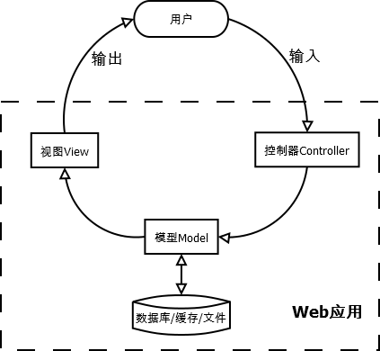

# MVC设计模式

## 介绍

**MVC**（Model-View-Controller）模式最早由Trygve Reenskaug在1978年提出，在20世纪80年代是程序语言Smalltalk的一种内部架构。后来MVC被其他语言所借鉴，成为了软件工程中的一种软件架构模式。MVC把Web应用系统分为3个基本部分。

**模型（Model）**：用于封装与应用程序的业务逻辑相关的数据及对数据的处理方法，是Web应用程序中用于处理应用程序的数据逻辑的部分，Model只提供功能性的接口，通过这些接口可以获取Model的所有功能。Model不依赖于View和Controller，它们可以在任何时候调用Model访问数据。有些Model还提供了事件通知机制，为在其上注册过的View或Controller提供实时的数据更新。

**视图（View）**：负责数据的显示和呈现，View是对用户的直接输出。MVC中的一个Model通常为多个View提供服务。为了获取Model的实时更新数据，View应该尽早地注册到Model中。

**控制器（Controller）**：负责从用户端收集用户的输入，可以看成提供View的反向功能。当用户的输入导致View发生变化时，这种变化必须是通过Model反映给View的。在MVC架构下，Controller一般不能与View直接通信，这样提高了业务数据的一致性，即以Model作为数据中心。

这3个基本部分互相分离，使得在改进和升级界面及用户交互流程时，不需要重写业务逻辑及数据访问代码。MVC架构如图1所示



## 理解

**控制器（Controller）**：可以被看作是一个介于用户，处理（model），显示（view）之间的中间人。它是用户请求的入口，也是应用处理的入口。控制模块接受用户输入，解析，决定哪一个model和view参与处理，因此，它决定了针对用户请求，选择何种view和model。

**模型（Model）**: 处理业务的应用程序，model操作数据库，比如插入，更新，删除。每个模型会提供固定类型的数据给控制模块，另一方面，控制模块可以调用模型的不同方法处理数据，并将处理后的结果返回给视图模型

**视图（View）** ：主要用来显示，通过控制模块获取模型模块处理后的数据，并进行格式化的显示。通过控制模块选择view并显示反馈给用户。view模型的选择是基于模型模块的l选择和用户配置等等。

## 总结

1. 控制模块用于获取用户输入，并将模型与视图建立联系
2. 模型主要是从存储区获取数据
3. 视图用于展示给用户，从模型获取的数据
4. mvc设计方法，看到了解耦的好处，个个模块独立，相互不影响，也可以增加模块。方便组合，方便拆卸。好好体会吧！

## 示例

测试管理系统用来查询错误列表

 情景描述：

- 　　如果用户查询一个特定的错误，测试管理系统以某种格式显示这个错误的描述
- 　　如果用户搜索相关错误的关键值，测试管理系统显示所有相关的错误列表

 创建SQLite 数据库，库名TMS，并创建一个表

| ID   | Component | Summary                       |
| ---- | --------- | ----------------------------- |
| 1    | XYZ       | File doesn't  get deleted     |
| 2    | XYZ       | Registry doesn't  get created |
| 3    | ABC       | Wrong title gets displayed    |

代码如下：

```python
#mvc.py
import sqlite4
import types

class DefectModel:
    def getDefectList(self, component):
        query = "select ID from defects where Component= '%s' " % component
        defectlist = self._dbselect(query)
        list = []
        for row in defectlist:
            list.append(row[0])

        return list

    def getSummary(self, id):
        query = "select summary from defects where ID='%d'" % id
        summary = self._dbselect(query)
        for row in summary:
            return row[0]

    def _dbselect(self, query):
        connection = sqlite3.connect('TMS')
        cursorObj = connection.cursor()
        results = cursorObj.execute(query)
        connection.commit()
        cursorObj.close()
        return results


class DefectView:
    def summary(self, summary, defectid):
        print "#### Defect Summary for defect# %d####%s\n" %(defectid, summary)

    def defectList(self, list, category):
        print "#### Defect List for %s ####\n" % category
        for defect in list:
            print defect

class Controller:
    def __init__(self):
        pass

    def getDefectSummary(self, defectid):
        model = DefectModel()
        view =  DefectView()
        summary_data = model.getSummary(defectid)
        return view.summary(summary_data, defectid)

    def getDefectList(self, component):
        model = DefectModel()
        view  = DefectView()
        defectlist_data = model.getDefectList(component)
        return view.defectList(defectlist_data, component)
```

 使用模块：

```python
import mvc

controller = mvc.Controller()

print  controller.getDefectSummary(2)
print  controller.getDefectList('ABC')
```